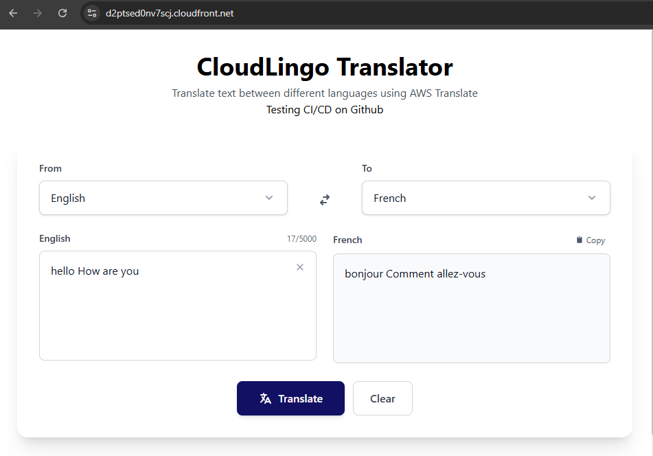
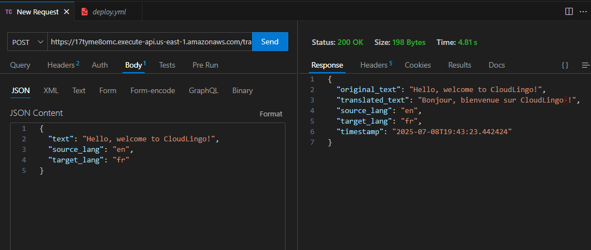

# 🌐 CloudLingo

CloudLingo is a serverless, scalable language translation app built on AWS using:

- **Amazon Translate** for real-time language translation
- **Amazon S3** for storing translation requests and results
- **AWS Lambda** for backend processing
- **API Gateway** for HTTP access
- **CloudFront + S3** for frontend hosting
- **Terraform** for Infrastructure as Code (IaC)
- **GitHub Actions** for CI/CD deployments
- **Boto3** with Python for AWS service integration inside Lambda

---

## 🚀 Features

- Users can input text and select source + target languages
- Translations are processed in real-time using AWS Translate
- All input/output is stored in S3 buckets
- Frontend is built with **React + Vite + Tailwind CSS**
- Deployed to AWS via CI/CD pipeline

---

## 📁 Project Structure

```bash
cloud-lingo-aws/
├── terraform/               # All Terraform IaC files
│   ├── lambda.tf
│   ├── apigateway.tf
│   ├── s3.tf
│   └── cloudfront.tf
├── react-frontend/          # React + Vite frontend
│   ├── src/
│   └── .env (generated at build)
├── lambda/                  # Python Lambda handler
│   └── translate_handler.py
├── .github/workflows/       # GitHub Actions CI/CD
│   └── deploy.yml
└── README.md
```

---

## 🛠 Prerequisites

- AWS Account (with programmatic access)
- Node.js + npm
- Terraform CLI
- GitHub account

---

## ⚙️ Deployment Steps

### 1. 🧱 Clone the Repo

```bash
git clone https://github.com/<your-username>/cloud-lingo-aws.git
cd cloud-lingo-aws
```

### 2. 🗂️ Set Up Terraform

Inside the `terraform/` directory:

```bash
cd terraform
terraform init
terraform plan
terraform apply
```

This will provision:

- IAM roles + policies
- Lambda function
- S3 buckets
- API Gateway
- CloudFront distribution

---

### 3. 🔐 Configure GitHub Secrets

Go to your repo → `Settings` → `Secrets and Variables` → `Actions`
Add the following secrets:

| Name                         | Description                                       |
| ---------------------------- | ------------------------------------------------- |
| `AWS_ACCESS_KEY_ID`          | IAM user's access key                             |
| `AWS_SECRET_ACCESS_KEY`      | IAM user's secret key                             |
| `CLOUDLINGO_API_URL`         | API Gateway endpoint (from Terraform output)      |
| `CLOUDFRONT_DISTRIBUTION_ID` | CloudFront distribution ID for cache invalidation |

---

## 🔐 Security Warning: IAM Best Practices

> ⚠️ **Always use least privilege when creating IAM users or roles.**

When generating credentials for GitHub Actions:

- ✅ Create a **dedicated IAM user** for this project
- ✅ Assign only the specific permissions needed
- ❌ **Never use your root account credentials**
- ❌ Avoid assigning `AdministratorAccess`

### 𞷾️ Sample IAM Policy for CI/CD Deployments

```json
{
  "Version": "2012-10-17",
  "Statement": [
    {
      "Effect": "Allow",
      "Action": [
        "s3:*",
        "cloudfront:CreateInvalidation",
        "lambda:InvokeFunction"
      ],
      "Resource": "*"
    }
  ]
}
```

📋 More info: [AWS IAM Best Practices](https://docs.aws.amazon.com/IAM/latest/UserGuide/best-practices.html)

---

## 🥪 Local Development

Inside the `react-frontend/` folder:

```bash
npm install
npm run dev
```

Create a `.env` file:

```env
VITE_TRANSLATE_API_URL=https://your-api-id.execute-api.us-east-1.amazonaws.com/translate
```

---

## 📸 Screenshots

### 🌤️ 1. Frontend UI (CloudLingo Web)



> Input text, select languages, and view translated output.

### 📬 2. API Test via Thunder Client



> JSON request and response directly through the deployed API.

---

## 🤝 Contribute

Fork the repo, make improvements, and submit PRs! Possible features:

- Language auto-detection
- Save translation history to DynamoDB
- Add login with AWS Cognito

---

## 📄 License

This project is open source under the [MIT License](LICENSE).

---

## 👨‍🏫 Created by

**Lord Baah** – AWS Cloud Engineer & Frontend Developer
🔗 [GitHub: @lordbaah](https://github.com/lordbaah)
