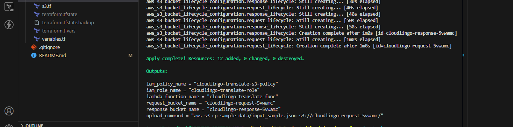

master branch

# CloudLingo 🌐📝

A serverless language processing service built with AWS Lambda and S3, designed to automatically process and analyze text files uploaded to cloud storage.

> **Capstone Project** - AWS Cloud Training Program  
> **Training Partner**: Azubi Africa in collaboration with Mastercard Foundation and Generation Ghana


## 🚀 Overview

CloudLingo is a cloud-native application that leverages AWS services to provide automated text processing capabilities. When files are uploaded to an S3 bucket, the service automatically triggers Lambda functions to process and analyze the content, making it perfect for batch text processing, document analysis, and language processing workflows.

This project demonstrates practical implementation of AWS serverless architecture, Infrastructure as Code (IaC) with Terraform, and cloud-native development practices as part of an AWS cloud training capstone project.

## 📸 Service Documentation & Proof of Concept

The following screenshots demonstrate the working service and successful deployment:

## 🛠️ Infrastructure Components

The Terraform configuration is organized into separate files for better maintainability:

- **[`main.tf`](terraform/main.tf)**: Core AWS provider and resource configurations
- **[`s3.tf`](terraform/s3.tf)**: S3 bucket setup with event notifications
- **[`lambda.tf`](terraform/lambda.tf)**: Lambda function configuration and deployment
- **[`iam.tf`](terraform/iam.tf)**: IAM roles, policies, and permissions
- **[`variables.tf`](terraform/variables.tf)**: Input variables and configuration
- **[`outputs.tf`](terraform/outputs.tf)**: Output values for created resources

The Lambda source code in [`terraform/lambda/`](terraform/lambda/) is automatically zipped and deployed by Terraform during the `terraform apply` process.

### 🏗️ Service Architecture


_AWS services and their interactions in the CloudLingo system_

### ⚡ Terraform Deployment


_Successful infrastructure provisioning using Terraform_

### 🪣 S3 Bucket Configuration


_S3 bucket with event notifications configured_

### λ Lambda Function


_Lambda function deployed and configured in AWS Console_

## 📁 Project Structure

```
cloud-lingo-aws/
├── lambda/                 # Lambda function source code
│   ├── main.py            # Main Lambda handler
│   ├── requirements.txt   # Python dependencies
│   └── utils/             # Utility functions
├── sample-data/           # Sample files for testing
│   ├── test-document.txt
│   └── example-data.json
├── terraform/             # Infrastructure as Code (Terraform)
│   ├── lambda/           # Lambda source code (auto-zipped by Terraform)
│   ├── main.tf           # Main Terraform configuration
│   ├── variables.tf      # Variable definitions
│   ├── outputs.tf        # Output values
│   ├── s3.tf            # S3 bucket configuration
│   ├── lambda.tf        # Lambda function configuration
│   └── iam.tf           # IAM roles and policies
├── screenshots/          # Documentation images
├── .gitignore           # Git ignore rules
└── README.md            # This file
```

## 🛠️ Prerequisites

Before deploying CloudLingo, ensure you have:

- AWS CLI configured with appropriate permissions
- Terraform >= 1.0 installed
- Python 3.9+ (for local development)
- An AWS account with necessary service quotas

## 🚀 Quick Start

### 1. Clone the Repository

```bash
git clone https://github.com/lordbaah/cloud-lingo-aws.git
cd cloud-lingo-aws
```

### 2. Configure AWS Credentials

```bash
aws configure
```

### 3. Deploy Infrastructure

```bash
cd terraform
terraform init
terraform plan
terraform apply
```


### 4. Test the Service

Upload a sample file to the created S3 bucket:

```bash
aws s3 cp sample-data/test-document.txt s3://your-cloudlingo-bucket/
```

### 5. Clean Up Resources (Important!)

⚠️ **To avoid AWS charges, destroy all resources after testing:**

```bash
cd terraform
terraform destroy
```

**Note**: Always run `terraform destroy` when you're done testing to prevent ongoing AWS costs.

## 📝 Configuration

### Environment Variables

The Lambda function uses the following environment variables:

- `BUCKET_NAME`: S3 bucket name for file processing
- `LOG_LEVEL`: Logging level (DEBUG, INFO, WARN, ERROR)
- `PROCESSING_TIMEOUT`: Maximum processing time per file

### Terraform Variables

Key variables in `terraform/variables.tf`:

```hcl
variable "aws_region" {
  description = "AWS region for deployment"
  default     = "us-east-1"
}

variable "project_name" {
  description = "Name of the project"
  default     = "cloudlingo"
}
```

## 🔧 Lambda Function Details

### Handler Function

The main Lambda handler is located in [`terraform/lambda/main.py`](terraform/lambda/main.py) and is automatically packaged and deployed by Terraform:

```python
def lambda_handler(event, context):
    """
    Main Lambda handler for processing S3 events
    Automatically deployed via Terraform
    """
    # Process S3 trigger events
    # Analyze uploaded files
    # Return processing results
```

### Terraform-Managed Deployment

- **Automatic Packaging**: Terraform zips the Lambda code during deployment
- **Source Location**: [`terraform/lambda/`](terraform/lambda/) directory
- **Dependencies**: Managed through `requirements.txt` in the Lambda folder
- **Configuration**: Defined in [`terraform/lambda.tf`](terraform/lambda.tf)

### Key Features

- **Automatic Triggering**: Responds to S3 PUT events
- **File Type Detection**: Supports multiple file formats
- **Error Handling**: Comprehensive error handling and logging
- **Scalable Processing**: Handles multiple files concurrently


## 📊 Sample Data

The [`sample-data/`](sample-data/) directory contains example files for testing:

- `test-document.txt`: Sample text file for processing
- `example-data.json`: JSON configuration examples

## 🛡️ Security & IAM Configuration


_IAM roles and policies ensuring secure access and least privilege_

## 📊 Service Performance


_Performance metrics and service health indicators_

## 🧪 Testing & Service Validation

Upload sample files to test the service:

```bash
# Upload test files to trigger Lambda processing
aws s3 sync sample-data/ s3://your-cloudlingo-bucket/

# Monitor processing logs
aws logs tail /aws/lambda/cloudlingo-processor --follow

# Clean up after testing (IMPORTANT!)
terraform destroy
```

⚠️ **Remember**: Always run `terraform destroy` after testing to avoid AWS charges!

### 📤 File Upload Process


_Demonstration of file upload to S3 bucket_

### 🔄 Lambda Execution


_Lambda function successfully processing uploaded files_

### 📊 CloudWatch Monitoring


_Real-time monitoring and logging of service operations_

### ✅ Processing Results


_Evidence of successful file processing and output generation_

## 🚀 Deployment

### Infrastructure Deployment

1. **Deploy AWS Resources**: Use Terraform to create all necessary AWS infrastructure
2. **Lambda Function**: Code is automatically packaged and deployed by Terraform
3. **Testing**: Upload sample files to verify functionality
4. **Clean Up**: Run `terraform destroy` to remove all resources and avoid costs

### 💰 Cost Management

**Important**: This project creates AWS resources that may incur charges. To avoid unexpected costs:

- Monitor your AWS billing dashboard during testing
- Run `terraform destroy` immediately after testing
- Consider using AWS Free Tier eligible services where possible
- Set up billing alerts in your AWS account

## 🔧 Customization

### Adding New Processing Logic

1. Modify [`terraform/lambda/main.py`](terraform/lambda/main.py)
2. Add dependencies to [`terraform/lambda/requirements.txt`](terraform/lambda/requirements.txt)
3. Update Lambda configuration in [`terraform/lambda.tf`](terraform/lambda.tf) if needed
4. Run `terraform apply` to deploy changes

### Scaling Considerations

- Lambda concurrency limits
- S3 request rates
- Processing time constraints
- Memory allocation

## 📋 Troubleshooting

### Common Issues

1. **Permission Errors**: Check IAM roles and policies
2. **Timeout Issues**: Increase Lambda timeout in Terraform
3. **Memory Errors**: Adjust Lambda memory allocation
4. **S3 Trigger Not Working**: Verify bucket notification configuration

### Debugging

```bash
# Check Lambda logs
aws logs describe-log-groups --log-group-name-prefix /aws/lambda/cloudlingo

# Monitor S3 events
aws s3api get-bucket-notification-configuration --bucket your-cloudlingo-bucket
```

## 🎓 Learning Objectives Demonstrated

This capstone project showcases the following AWS cloud skills:

- **Infrastructure as Code**: Using Terraform to provision AWS resources
- **Serverless Architecture**: Implementing event-driven processing with Lambda
- **Cloud Storage**: Leveraging S3 for file storage and event triggers
- **Security**: Implementing proper IAM roles and policies
- **Monitoring**: Setting up CloudWatch for logging and monitoring
- **Automation**: Creating fully automated deployment pipelines

## 🤝 Usage

Feel free to clone and use this project to learn about AWS serverless architecture and Infrastructure as Code with Terraform.

## 📄 License

This project is licensed under the MIT License - see the [LICENSE](LICENSE) file for details.

## 🙏 Acknowledgments

- Azubi Africa for the comprehensive AWS cloud training
- Mastercard Foundation and Generation Ghana for program support
- AWS Documentation and community resources

## 📞 Support

For questions about this project:

- Review the troubleshooting section above
- Check AWS documentation for service-specific issues
- Explore the code structure and Terraform configurations

---

**📝 Documentation Note**: All screenshots above serve as proof of concept and evidence that the CloudLingo service has been successfully implemented, deployed, and tested in a live AWS environment.
